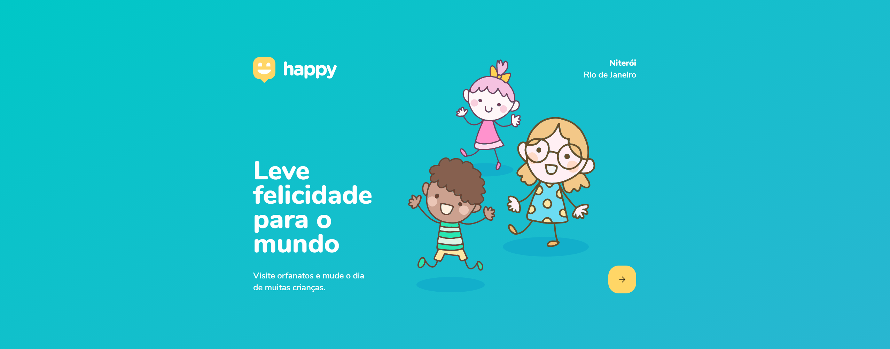
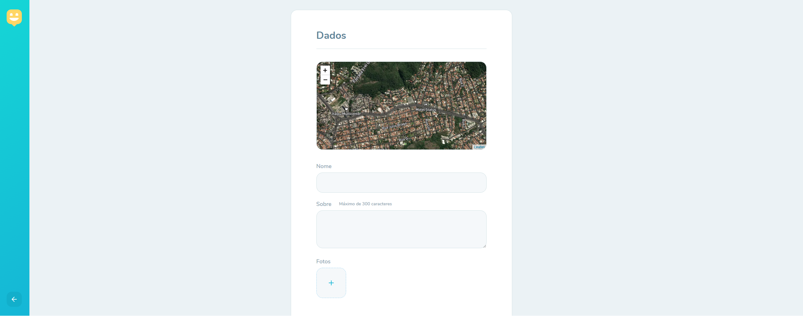
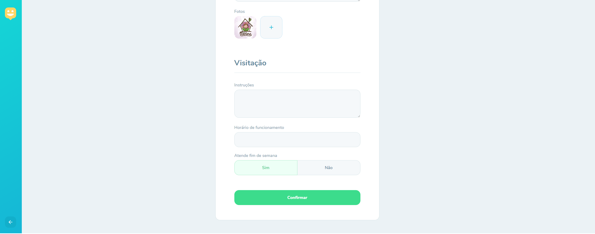
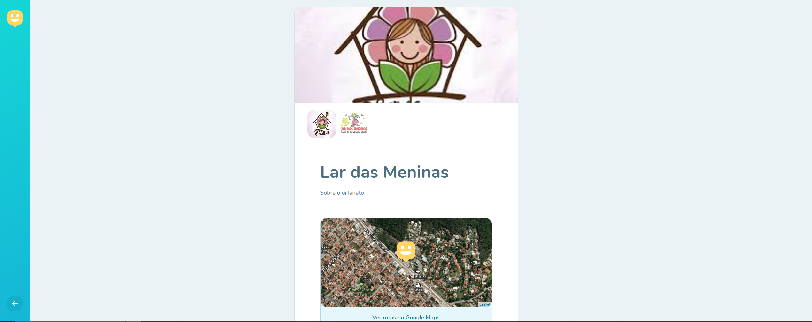
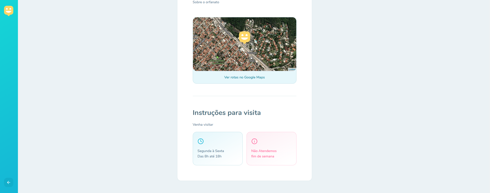

<p align="center">
   
</p>

<p align="center">	
   <a href="https://www.linkedin.com/in/carloseac/">
      
   </a>
  

  <a aria-label="Completed" href="https://nextlevelweek.com/episodios/omnistack/edicao/3">
    </img>
  </a>
  <a href="https://github.com/RafaelGoulartB/proffy/commits/master">
    
  </a> 
  
  <a href="https://github.com/CarlosEduAC/Happy/stargazers">
    
  </a>
</p>

> :rocket: Plataforma que pretende levar felicidade para o mundo, feito na Next Level Week #3 @Rocketseat

<div align="center">
  <sub>The NLW #3 project. Built with ❤︎ by
    <a href="https://github.com/CarlosEduAC">Carlos Cardoso</a> and
    <a href="https://github.com/CarlosEduAC/Happy/graphs/contributors">
      contributors
    </a>
  </sub>
</div>


# :pushpin: Tabela de Conteúdo

<!-- * [Site de Demostração](#eyes-site-de-demostração)  -->
* [Tecnologias](#computer-tecnologias)
* [Funcionalidades](#rocket-funcionalidades)
* [Como rodar](#construction_worker-como-rodar)
* [Encontrou um bug? Ou está faltando uma feature?](#bug-problemas)
* [Licencia](#closed_book-licencia)

## 📥 Layout  

### Web Screenshot
<div style="display: flex; flex-direction: 'row'; align-items: 'center';">
   
   
   
   
   
   
</div>

<!-- ### Mobile Screenshot
<div style="display: flex; flex-direction: 'row';">
   
   
   
   
</div> -->

<!-- # :eyes: Site de Demostração
Você pode acessar o site em:     
👉  demo: https://proffy-rafa.netlify.app/ 

[](https://app.netlify.com/sites/proffy-rafa/deploys)      -->

# :computer: Tecnologias
Esse projeto foi feito utilizando as seguintes tecnologias:

* [Typescript](https://www.typescriptlang.org/)   
* [NodeJS](https://nodejs.org/en/)   
* [React](https://reactjs.org/)      
* [React Native](https://reactnative.dev/)      
* [Expo](https://expo.io/)       
* [Express](https://expressjs.com/) 

# :rocket: Funcionalidades

* Site para cadastro e busca de Instituições de Acolhimento.
* App para cadastro e busca de Instituições de Acolhimento.

# :construction_worker: Como rodar
```bash
# Clone o Repositoria
$ git clone https://github.com/CarlosEduAC/Happy.git
```
### 📦 Rode a API

```bash
# Vá para a pasta do servidor
$ cd Happy/backend

# Instale as depedencias
$ yarn install

# Rode a aplicação
$ yarn start
```
Acesse a API: http://localhost:3333/

### 💻 Rode o Project Web

```bash
# Vá para a pasta web
$ cd Happy/web

# Instale as depedencias
$ yarn install

# Rode a aplicação
$ yarn start
```
Acesse: http://localhost:3000/ para ver o resultado.

### 📱 Run Mobile Project
Para rodar o projeto mobile você precisa de um celular com o [expo](https://play.google.com/store/apps/details?id=host.exp.exponent) instlado ou um emulador android/ios.

```bash
# Vá para a pasta mobile
$ cd Happy/mobile

# Instale as depedencias
$ yarn install

# Rode a aplicação
$ yarn start
```
Depois leia o QRCode com o app do [expo](https://play.google.com/store/apps/details?id=host.exp.exponent) ou rode em um emulador.


# :bug: Problemas

Fique a vontade **para criar uma nova issue** com o respectivo titulo e descrição na página de issues do [Happy](https://github.com/CarlosEduAC/Happy/issues) Repositorio. Se você já encontrou a solução para o problema, **Eu amaria fazer o review do seu pull request**!


# :closed_book: Licencia

Lançado em 2020 :closed_book: Licencia

Made with love by [Carlos Cardoso](https://github.com/CarlosEduAC) 🚀.
Esse projeto esta sobre [MIT license](./LICENSE).


Dê uma ⭐️ se esse projeto te ajudou!
